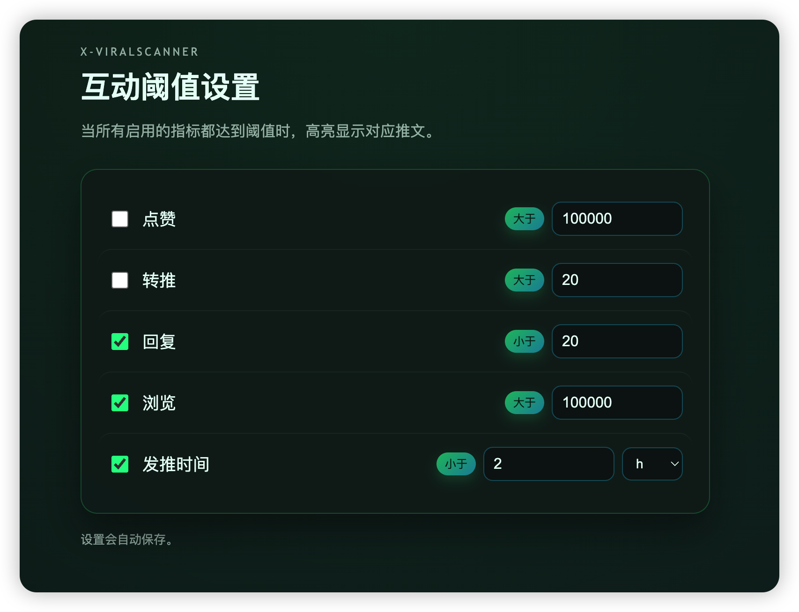

# X-ViralScanner

一个基于 MV3 的 Chrome 扩展，用于在 X（x.com）上自动识别满足互动阈值的推文并高亮显示。

## 功能

- 自定义互动阈值：点赞 / 转推 / 回复 / 浏览 / 发推时间
- 每个指标可单独启用或关闭
- 发推时间支持 `h` / `min` 单位
- DOM 解析（不使用官方 API）
- 支持无限滚动动态加载
- 绿色 → 青色渐变高亮 + 轻微动画

## 默认比较方向

- 点赞：大于
- 转推：大于
- 回复：小于
- 浏览：大于
- 发推时间：小于（越新越符合）

> 只有启用的指标会参与判断，全部启用指标都满足时才会高亮。

## 安装

1. 打开 `chrome://extensions`
2. 开启开发者模式
3. 点击“加载已解压的扩展程序”，选择本项目目录

## 使用

1. 打开 `https://x.com/*`
2. 满足阈值的推文会自动高亮
3. 在扩展“选项”页调整阈值（会自动保存）

## 文件结构

- `manifest.json`
- `content/content-script.js`
- `content/content-style.css`
- `options/options.html`
- `options/options.js`
- `options/options.css`
- `assets/`

## 图标说明

默认使用以下图标尺寸：

- `assets/icon-16.png`
- `assets/icon-32.png`
- `assets/icon-48.png`
- `assets/icon-128.png`

如果只想替换图标，保持文件名不变即可。

## 说明

- 本扩展完全基于 DOM 解析，不调用 X 官方 API
- 若 X 页面结构改变，可能需要更新选择器

## 预览

## License

MIT
